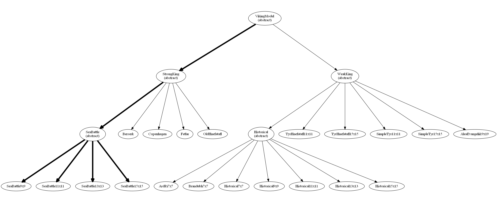
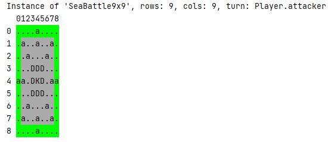
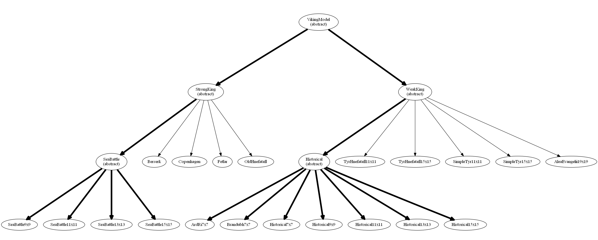

# flutter_viking_student

A Dart (and eventually Dart+Flutter) project to implement the viking chess game 
(actually a family of games, see below).

[//]: # (Comment: first is for dartdoc html; second is for github)




## Getting started

You start working at your first job at GH&trade; (Generally Hectic&trade;) on a family of board games based on viking chess.
Your first assignment is to work on the Sea Battle game, specifically. The lead architect
on the project has already created a framework for the logic behind the game 
for you to use. She has also created a way for you to exercise your code from
the good old command line while she continues to work on the GUI (based on 
Flutter).

---
### assignment #1: set up Sea Battle

- Complete the SeaBattle (see SeaBattle.dart in lib) __ctors__ (viz., SeaBattle9x9, SeaBattle11x11, 
  SeaBattle13x13, and SeaBattle15x15).
  Use these rules (see sea_battle_rules.pdf) as a reference.

- Complete toString in VikingModel (see VikingModel.dart in lib). It should return (not print) a string that 
  looks something like the following when printed (or saved to a text file, or
  transmitted around the world and viewed with a browser or a text editor). 
  These are just examples below. Your string does not have to be exactly like 
  them. Anything reasonable is acceptable. All fields and their corresponding 
  values should be represented.
  Note that what we consider to be 'the board' actually consists of two components:
  (a) the actual pieces on the board, and 
  (b) the underlying board itself.
  In the first figure below, the top represent
  the pieces on the board and the bottom represents the underlying board.
  In the second figure below, they appear side-by-side. The third figure below
  uses color to combine both into one.
```
  Instance of 'SeaBattle9x9', rows: 9, cols: 9, turn: Player.attacker
    012345678
  0 ....a....
  1 .a..a..a.
  2 ..a...a..
  3 ...DDD...
  4 aa.DKD.aa
  5 ...DDD...
  6 ..a...a..
  7 .a..a..a.
  8 ....a....

    012345678
  0 eeeeeeeee
  1 e.......e
  2 e.......e
  3 e.......e
  4 e.......e
  5 e.......e
  6 e.......e
  7 e.......e
  8 eeeeeeeee
```
Or even better (and for full credit):
```
  Instance of 'SeaBattle9x9', rows: 9, cols: 9, turn: Player.attacker
    012345678    012345678
  0 ....a....    eeeeeeeee
  1 .a..a..a.    e.......e
  2 ..a...a..    e.......e
  3 ...DDD...    e.......e
  4 aa.DKD.aa    e.......e
  5 ...DDD...    e.......e
  6 ..a...a..    e.......e
  7 .a..a..a.    e.......e
  8 ....a....    eeeeeeeee
```
Or even more better (sic), (by embedding controls sequences provided in
lib/terminal.dart) in the string):

[//]: # (Comment: first is for dartdoc html; second is for github)




   

The "colorized" example directly above is challenging. It is NOT required. It is for extra 
credit (and my undying respect and admiration) only.

---
### assignment #2: the power of inheritance!
1. Other individuals at GH&trade; have been hard at work on other parts of the project.
   Before you can incorporate their changes (on the remote repo), you must commit (save) your
   changes to your local repo. Run Android Studio, open your project (if it's not
   already open), and then select _Commit_ from the Git menu.
   Enter 'finished assignment #1' in the _Commit Message_ area, and then press _Commit_.
   If prompted for your email, enter it. Press the _Commit_ button if asked about warnings.
1. To incorporate the changes on the remote repo with your code, you need to first run Android Studio,
   open your project, and then select _Pull..._ from the Git menu.
   This will update your code with their changes.
   Make sure that you can run your code without any errors before proceeding.
   (If you have errors after the pull, please contact me.)
1. In VikingModel, complete:
    - isInBounds,
    - getPiece  (should use isInBounds),
    - getSquare (should use isInBounds), and
    - getPlayer (should use isInBounds).
1. Take a look at the definition of the enum Square (in VikingModel.dart).
   Ensure that your toString includes something reasonable for all of these values (some
   are supported by the the games below).
1. In Historical, complete Historical ctors (viz., Historical7x7, ..., Historical15x15).
   (This part should be relatively easy (if you did a good job on assignment #1).
   There is a great deal of commonality between Sea Battle setups and Historical.)
1. In ArdRi7x7, complete the ctor. This part is trivial. Simply copy the set up code
   in Historical7x7 to ArdRi7x7. (The difference between these games is in the presence
   or absence of a throne and/or corner exits. This is already done for you.)
1. In Brandubh7x7, complete the ctor. This part is trivial. Simply copy the set up code
   in Historical7x7 to Brandubh7x7. (The difference between these games is in the presence
   or absence of a throne and/or corner exits. This is already done for you.)

At this point, take a look at how much of the family tree is filled in.
Pat yourself on the back! Don't worry about the remaining games.
We are going to concentrate on the game logic in the future.

[//]: # (Comment: first is for dartdoc html; second is for github)




---
### assignment #3: add the gui (graphical user interface)
1. As (what will become) usual, commit your changes to your local repo as follows.
   Run Android Studio, open your project (if it's not
   already open), and then select Commit from the Git menu.
   Enter 'finished assignment #2' in the Commit Message area, and then press Commit.
   If prompted for your email, enter it. Press the Commit button if asked about warnings.
1. **Make a copy of your work.**
   Others at GH&trade; have been hard at work on the gui and now it's ready! Before you
   add the new gui code to yours, make sure that you make a copy of the entire project 
   directory (folder) _before_ you pull from the repo.
1. To incorporate changes on the remote repo with your code, you need to first run Android Studio,
   open your project, and then select Pull... from the Git menu.
   This will update your code with any changes.
1. Before you can run **main.dart** in lib for the new ui, you need to **Get dependencies** first.
   So do **Get dependencies** or **Tools --> Flutter --> Flutter Pub Get**.
1. Before you can run the new gui, change **<no device selected>** to a specific device. You 
   are only required to get one device working. Devices include windows desktop, 
   mac desktop, android phone or table, apple phone or tablet, or android device emulator.
1. Run main.dart. Take a screen capture and save it in a file. That's it!

Notes: Ignore the message **Flutter device frame rate invalid** if it appears.

If you are unable to get a gui version running please try the following
sequence of commands to get the chrome version running (after you exit android
studio and then open up a command prompt/terminal window):
1. cd flutter_viking_student
1. flutter pub get
1. flutter config --enable-web
1. flutter create .
1. flutter run lib/main.dart

Note to Windows users: If flutter is not in your path, try \flutter\bin\flutter
above.


---
### assignment #4: is a move acceptable or not?
Before we can actually perform a move, we must ensure that the move is acceptable.
Begin working on isMoveOk in VikingModel. **This function does not perform the move 
(i.e., it does not modify any data).** 
it simply returns true or false to indicate whether or not it is acceptable.
Here are situations that you should handle:
1. As usual, commit your changes to your local repo as follows.
   Run Android Studio, open your project (if it's not
   already open), and then select Commit from the Git menu.
   Enter 'finished assignment #3' in the Commit Message area, and then press Commit.
   If prompted for your email, enter it. Press the Commit button if asked about warnings.
1. **Make a copy of your work.**
   Others at GH&trade; have been hard at work on the gui and now it's ready! Before you
   add the new gui code to yours, make sure that you make a copy of the entire project 
   directory (folder) _before_ you pull from the repo.
1. To incorporate any changes on the remote repo with your code, you need to first run Android Studio,
   open your project, and then select Pull... from the Git menu.
   This will update your code with any changes.
   Make sure that you can run your code without any errors before proceeding.
1. Out-of-bounds moves are not ok.
1. One may only move a piece of the type that corresponds to the current turn.
1. One cannot move onto (on top of) an existing piece.
1. One may only move horizontally or vertically (never diagonally, etc.).
   (Note: The next assignment will have you modify this to disallow moves through
   intervening pieces. This situation may be ignored for this assignment.)

Of course you should also include more mundane "sanity checks" of your own as well.
The next assignment will add additional rules.
Don't forget to comment your code (or else).

---
### assignment #5: modify isMoveOk (in VikingModel) to handle the following:
1. As usual, commit your changes to your local repo as follows.
   Run Android Studio, open your project (if it's not
   already open), and then select Commit from the Git menu.
   Enter 'finished assignment #3' in the Commit Message area, and then press Commit.
   If prompted for your email, enter it. Press the Commit button if asked about warnings.
1. Make a copy of your own work (see above).
1. To incorporate any changes on the remote repo with your code, you need to first run Android Studio,
   open your project, and then select Pull... from the Git menu.
   This will update your code with any changes.
   Make sure that you can run your code without any errors before proceeding.
1. It is _not_ ok to allow moves after the game is over.
1. One cannot move through/jump over piece(s).
1. Only the king may occupy the throne (in games that have a throne). 
   (But other pieces are free to move through it when unoccupied.)
1. Only the king may occupy a corner exit (in games that have corner exits).

---
### assignment #6: clone and equals.
1. Commit your changes to your local repo (see above).
1. Make a copy of your own work (see above).
1. Incorporate any changes on the remote repo with your code (see above).
1. Implement clone (AKA deep copy) by finishing copyValues in VikingModel.
1. Implement equals method, ==, in VikingModel.

---
### assignment #7: implement hashcode in VikingModel.dart.
<p>Read chapter 3 of "Effective Java" by Joshua Bloch, 3rd ed., 2018 (freely and legally available 
from <a href="https://raw.githubusercontent.com/muhdkhokhar/test/master/Joshua%20Bloch%20-%20Effective%20Java%20(3rd)%20-%202018.pdf">https://raw.githubusercontent.com/muhdkhokhar/test/master/Joshua%20Bloch%20-%20Effective%20Java%20(3rd)%20-%202018.pdf</a>), 
especially Item 11. Also visit <a href="https://dart-lang.github.io/linter/lints/hash_and_equals.html">https://dart-lang.github.io/linter/lints/hash_and_equals.html</a> 
for a similar sentiment expressed for dart.</p>
<p>Add a hash code function to VikingModel as follows (if not already there; I may have updated the 
repo):</p>
<pre>        @override
        int get hashCode {
            return 0;
        }
</pre>
<p>Using the java_hashcode_wikipedia.pdf file below as a guide, complete hashCode. You may use the 
built-in hashCode values for all individual s<sub>i</sub> data values contained in a VikingModel 
instance when calculating it, if you wish. You might need to include the following import: 
import 'dart:math';</p>
<p><a title="java_hashcode_wikipedia.pdf" href="/courses/25881/files/3562970?wrap=1">java_hashcode_wikipedia.pdf</a>.</p>

---
### assignment #8: undo and repeats.
This assignment is relatively easy.

1. Implement the capability to undo moves. (This requires a working clone 
   method.) Note the undo list in VikingModel is a list of VikingModel 
   instances. performMove adds a clone of this to the undo list, and then 
   performs the move. For this part, all one has to do is to complete the 
   todo regarding undo in cli_main.dart. Similarly, complete doUndo in 
   Controller for the graphical version of the game.
1. Complete checkThreeRepeatedMoves. We will use a very simple definition 
   (of what a "repeated move" is exactly) for this. A player loses when 
   they perform the same exact move 3 times in a row. Note that performMove 
   calls setGameOverAndWinner which in turn calls checkThreeRepeatedMoves. 
   checkThreeRepeatedMoves should return true if the current player has 
   repeated the same move 3 times in a row (not over the entire game); 
   false otherwise.

---
### assignment #9: at least one move.
1. Commit your changes to your local repo (see above).
1. Make a copy of your own work (see above).
1. Incorporate any changes on the remote repo with your code (see above).
1. Complete hasAtLeastOneMove in VikingModel.

---
### assignment #10: winners and losers (in progress).

---
### assignment #11: begin handling captures by implementing performCapture (in progress).

---
### assignment #12: modify isMoveOk to handle more possible moves (in progress).

